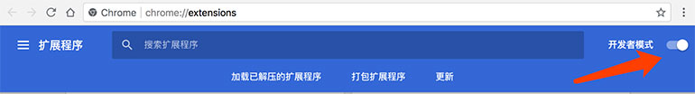
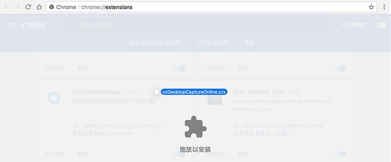
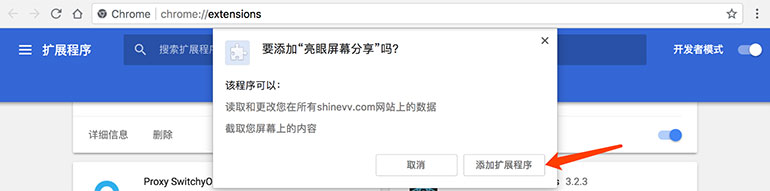
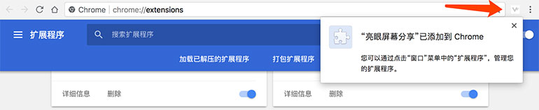

# Chrome浏览器添加亮眼课堂屏幕共享功能支持
Google为了保证Chrome浏览器的安全性，对Chrome浏览器的扩展安装渠道进行了严格的限制。目前我们已经无法通过技术手段再为各位的Chrome浏览器自动添加“亮眼屏幕分享”。

Google之所以这么做，是希望大家能通过Chrome网上应用店来进行安装。但是由于“众所周知”的原因，Google旗下的网站现在都是打不开的。。。

所以我们只能教各位，如何手动向Chrome浏览器中添加“亮眼屏幕分享”扩展的方法。

## 添加步骤
* 点击下载“亮眼屏幕分享”安装文件：[vvDesktopCaptureOnline.crx](https://www.shinevv.com/vvDesktopCaptureOnline.crx)

* 打开Chrome浏览器，在地址栏中输入chrome://extensions并按回车，将会打开“扩展程序”页面，手动打开“开发者模式"    

* 按住鼠标左键将下载好的插件安装文件拖拽至Chrome浏览器的主界面中，看到Chrome浏览器中出现“拖放以安装”提示时，松开鼠标左键    

* 在弹出的确认窗口上点击“添加扩展程序”即可    

* 安装成功后在浏览器菜单中可以看到“亮眼屏幕共享”插件，重启浏览器，这样您就可以在亮眼课堂中使用屏幕共享功能了    
